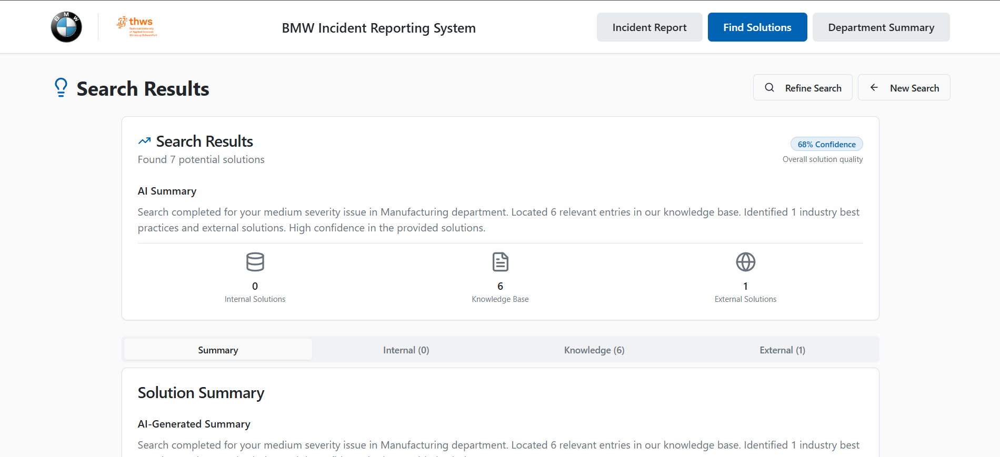

# BMW Lessons Learned System



A comprehensive AI-powered platform for capturing, analyzing, and sharing quality issues and lessons learned across BMW's manufacturing departments. The system enables teams to document incidents, search for solutions across multiple sources, and generate AI-driven insights for continuous improvement.

## 🎯 System Overview

The BMW Lessons Learned System is designed to:
- **Capture** quality issues and incidents from various departments
- **Analyze** patterns and generate AI-powered insights
- **Search** for solutions across internal database, knowledge base, and web sources
- **Share** best practices and preventive actions across the organization

## 🏗️ System Architecture

### Backend (FastAPI)
- **Framework**: FastAPI
- **Database**: SQLite with vector similarity search
- **AI Integration**: OpenAI for analysis and web search
- **File Storage**: Local file system for attachments

### Frontend (React + TypeScript)
- **Framework**: React 18 with TypeScript
- **UI Library**: shadcn/ui components
- **State Management**: React Query for API calls
- **Routing**: React Router DOM
- **Forms**: React Hook Form with Zod validation

### Key Features
1. **Incident Reporting**: Comprehensive form for documenting quality issues
2. **AI Analysis**: Automatic generation of lessons learned, best practices, and preventive actions
3. **Multi-Source Solution Search**: Search across internal database, RAG knowledge base, and web sources
4. **Department Analytics**: AI-powered insights and trend analysis
5. **File Attachments**: Support for image uploads and document storage

## 🔍 Find Solutions Feature

The "Find Solutions" feature searches across **three sources** to provide comprehensive solution recommendations:

### 1. Internal Database Search
- **Semantic Similarity**: Uses OpenAI embeddings to find similar incidents
- **Text Matching**: Fallback to keyword-based search

### 2. Knowledge Base (RAG)
- **Document Processing**: Excel files converted to searchable chunks
- **Context-Aware**: Maintains document structure and relationships

### 3. External Web Search
- **OpenAI Web Search**: Uses GPT-4o with web search tool
- **BMW Context**: Optimized for automotive manufacturing queries

## 🚀 Quick Start

### Prerequisites
- Python 3.11+
- Node.js 18+
- OpenAI API key

### Environment Setup

#### Backend
```bash
cd backend
cp .env.example .env
# Edit .env with your OpenAI API key
```

## 🐳 Running with Docker (Recommended)

### Start the entire system:
```bash
docker-compose up --build
```

### Access the application:
- **Frontend**: http://localhost:8080
- **Backend API**: http://localhost:3000
- **API Docs**: http://localhost:3000/docs

### Stop the system:
```bash
docker-compose down
```

## 💻 Running without Docker

### Backend Setup
```bash
cd backend

# Create virtual environment
python -m venv venv
source venv/bin/activate  # On Windows: venv\Scripts\activate

# Install dependencies
pip install -r requirements.txt

# Start the server
uvicorn app.main:app --reload --host 0.0.0.0 --port 3000
```

### Frontend Setup
```bash
cd frontend

# Install dependencies
npm install

# Start development server
npm run dev
```

### Access the application:
- **Frontend**: http://localhost:5173
- **Backend API**: http://localhost:3000

## 📊 Database Setup

### Generate Synthetic Data (for testing)
```bash
cd backend
python generate_synthetic_data.py
```

This will populate the database with realistic test data for all departments.

## 👥 Contributors

- **Abdullah Abdelrazek** - System design, backend development, AI integration, and full-stack component integration
  - GitHub: [@3bodymo](https://github.com/3bodymo)
  
- **Harsha Thasish** - Frontend development and RAG system
  - GitHub: [@hxrshx](https://github.com/hxrshx)
  
- **Prahas Hegde**
  - GitHub: [@PrahasHegde](https://github.com/PrahasHegde)
  
- **Rohan Sanjay Patil** - Data structuring, analysis, and RAG contributions
  - GitHub: [@rohan2700](https://github.com/rohan2700)
  
- **Bibin Babu** - RAG system development
  - GitHub: [@bibinsees](https://github.com/bibinsees)
  
- **Harshith Babu** - RAG system development
  - GitHub: [@Haarshiith](https://github.com/Haarshiith/)
  
- **Zeyi Lu** - Multi-format LL content generation
  - GitHub: [@ZEYILU](https://github.com/ZEYILU)

## 🙏 Acknowledgments

Developed as part of the CAIRO Hackathon on October 17, 2025, for BMW, addressing manufacturing quality improvement and lessons learned challenges in BMW automotive production.

---

**Built with ❤️ for BMW Manufacturing Excellence**
